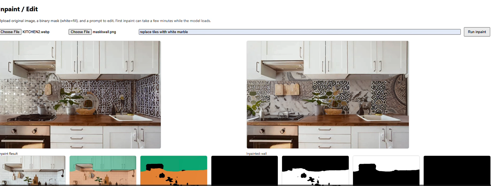

# KitchenAI

> Upload a photo of your kitchen. Pick a style. Watch it transform.

KitchenAI is a local-first redesign tool that combines **semantic segmentation** (SegFormer) with **Stable Diffusion inpainting** to swap out kitchen surfaces — floors, cabinets, backsplash, countertops — based on a text-driven style. No cloud API, no subscription, no account. It runs entirely on your own machine.

**Demo:**



[▶ Watch the full demo on Google Drive](https://drive.google.com/file/d/1A-Nrth29YXSgPVSNeFM0EsnOMUIb_Ztl/view?usp=sharing)

---

## Table of Contents

1. [How it works](#1-how-it-works)
2. [Getting started](#2-getting-started)
3. [Project layout](#3-project-layout)
4. [Architecture overview](#4-architecture-overview)
5. [Available styles](#5-available-styles)
6. [Usage — web UI and API](#6-usage--web-ui-and-api)
7. [API reference](#7-api-reference)
8. [Configuration](#8-configuration)
9. [Hardware and disk requirements](#9-hardware-and-disk-requirements)
10. [Contributing](#10-contributing)
11. [Known issues](#11-known-issues)
12. [Roadmap](#12-roadmap)
13. [License](#13-license)

---

## 1. How it works

There are two AI steps, run back-to-back for every redesign request.

### Step 1 — Segmentation

The uploaded image is passed through **SegFormer-B0**, fine-tuned on the ADE20K indoor scene dataset. Every pixel gets assigned a class label. KitchenAI pulls out four classes:

| Region | ADE20K class ID |
|---|---|
| Floor | 3 |
| Wall / Backsplash | 0 (lower wall crop) |
| Cabinet | 24 |
| Countertop | 46 |

Each class becomes a **binary mask** — a same-size black-and-white image where white means "this region". Masks are saved to disk under a session ID so the inpainter can load them independently.

Before inpainting, every mask goes through a small post-processing pipeline to avoid sharp, artificial boundaries:

```
raw binary mask (0 / 255)
  → MaxFilter (5 px)     — dilates edges slightly so boundary pixels aren't missed
  → GaussianBlur (r=2)   — feathers the edge for smooth material blending
  → alpha composite      — result blended back onto original outside the mask
```

### Step 2 — Inpainting

**Stable Diffusion Inpainting** (`runwayml/stable-diffusion-inpainting`) takes the original image, the combined mask, and a style prompt, and generates new pixels for every masked region. Everything outside the mask is taken directly from the original — the room's lighting, geometry, and perspective are preserved.

Each style has a hand-tuned config:

| Parameter | What it controls |
|---|---|
| `prompt` | What materials/look to generate |
| `negative_prompt` | What to explicitly avoid |
| `strength` | How far from the original the result is allowed to drift (0.0–1.0) |
| `guidance_scale` | How literally to follow the prompt |
| `num_inference_steps` | Quality vs. speed trade-off |

Models are loaded once and kept in memory (`ModelStore` in `loaders.py`). On CUDA, they run in `float16` to halve VRAM usage. The first request is slow while models load; all subsequent requests skip that overhead.

---

## 2. Getting started

### Prerequisites

| Requirement | Version | Notes |
|---|---|---|
| Python | 3.10+ | 3.11 recommended |
| Node.js | 18+ | For the frontend |
| npm | 9+ | Ships with Node.js |
| Git | any | — |
| CUDA GPU | optional | ~30 sec/image with GPU; ~15 min on CPU |

### Clone

```bash
git clone https://github.com/yuvrajsharmaaa/kitchenai.git
cd kitchenai
```

### Backend

```bash
cd backend
python -m venv .venv

# Windows (PowerShell)
.\.venv\Scripts\Activate.ps1

# macOS / Linux
source .venv/bin/activate

pip install -r requirements.txt
pip install "diffusers>=0.27.0" accelerate safetensors
```

### Frontend

```bash
cd frontend
npm install
```

### Run

**Terminal 1 — backend:**
```bash
cd backend
uvicorn app.main:app --reload --host 127.0.0.1 --port 8001
```

**Terminal 2 — frontend:**
```bash
cd frontend
npm run dev
```

- Frontend: http://localhost:3000
- Interactive API docs: http://127.0.0.1:8001/docs
- Health check: http://127.0.0.1:8001/api/health

> **First run — model downloads.** On the very first request, two models are fetched from Hugging Face and cached in `~/.cache/huggingface/`. This needs an internet connection and about 4.5 GB of disk space. After that, nothing is re-downloaded.
>
> | Model | Size | Role |
> |---|---|---|
> | `nvidia/segformer-b0-finetuned-ade-512-512` | ~300 MB | Region detection |
> | `runwayml/stable-diffusion-inpainting` | ~4.2 GB | Style generation |

---

## 3. Project layout

```
kitchenai/
│
├── backend/
│   ├── app/
│   │   ├── ai/
│   │   │   ├── segmentation/
│   │   │   │   └── segformer.py       # Runs SegFormer, produces per-class masks
│   │   │   ├── inpainting/
│   │   │   │   └── sd_inpaint.py      # Calls the SD inpainting pipeline
│   │   │   ├── styles_config.py       # Style definitions: prompt, strength, guidance, steps
│   │   │   └── loaders.py             # Lazy model loading + in-memory caching (ModelStore)
│   │   │
│   │   ├── api/
│   │   │   └── routes.py              # /segment, /redesign, /styles endpoints
│   │   │
│   │   ├── core/
│   │   │   └── config.py              # App settings; reads env vars
│   │   │
│   │   ├── services/
│   │   │   ├── segmentation.py        # Orchestrates segmentation flow
│   │   │   └── redesign.py            # Orchestrates inpainting flow
│   │   │
│   │   ├── utils/                     # Image I/O helpers
│   │   └── main.py                    # FastAPI app init, CORS config
│   │
│   ├── outputs/                       # Auto-created; one subdirectory per session
│   │   └── {session_id}/
│   │       ├── original.jpg
│   │       ├── mask_floor.png
│   │       ├── mask_cabinet.png
│   │       ├── mask_backsplash.png
│   │       └── mask_countertop.png
│   │
│   └── requirements.txt
│
├── frontend/                          # Next.js app
├── assests/                           # Demo screenshots
├── CHANGELOG.md
├── CONTRIBUTING.md
└── LICENSE
```

---

## 4. Architecture overview

```
FRONTEND  (Next.js, localhost:3000)
  │
  │  POST /api/segment   ← multipart image upload
  │  POST /api/redesign  ← JSON { session_id, style_name }
  │
  ▼
FASTAPI BACKEND  (localhost:8001)
  │
  ├── /segment  → SegmentationService
  │                  └── SegFormerSegmenter
  │                        ├── resize to 512×512
  │                        ├── SegFormer forward pass → pixel class map
  │                        ├── extract floor / cabinet / backsplash / countertop masks
  │                        └── save masks + original to outputs/{session_id}/
  │
  └── /redesign → RedesignService
                     ├── load original + masks from outputs/{session_id}/
                     ├── look up style prompt from styles_config.py
                     ├── combine masks into one composite
                     └── sd_inpaint.run_sd_inpaint()
                           ├── resize to SD-compatible dims (multiple of 8)
                           ├── SD inpainting forward pass
                           ├── composite result back onto original using mask as alpha
                           └── return before_b64, after_b64
```

The frontend never touches disk — it only gets base64-encoded images back from the API and renders them in the browser.

---

## 5. Available styles

| ID | Name | What changes |
|---|---|---|
| `italian_marble` | 🏛️ Italian Marble | White Carrara marble with grey veining across counters and backsplash; polished stone floor |
| `wooden_rustic` | 🪵 Wooden Rustic | Warm oak-grain cabinets, reclaimed wood flooring, natural earthy tones throughout |
| `modern_white` | 🤍 Modern White | Flat white lacquer surfaces, minimal hardware, Scandinavian-influenced clean lines |
| `dark_luxury` | 🖤 Dark Luxury | Matte black cabinets, dark veined marble countertops, moody high-contrast palette |

Check available styles at runtime:
```bash
curl http://127.0.0.1:8001/api/styles
```

---

## 6. Usage — web UI and API

### Web interface

1. Open http://localhost:3000
2. Upload a JPG or PNG of a kitchen
3. Click **Segment** — the system highlights detected regions with a colour overlay
4. Select a style from the four buttons
5. Click **Apply Style** — generation takes 15–90 sec on GPU, ~15 min on CPU
6. The before/after comparison loads automatically when done

### API — direct usage

**Segment an image:**
```bash
curl -X POST "http://127.0.0.1:8001/api/segment" \
  -F "file=@/path/to/kitchen.jpg"
```
```json
{
  "session_id": "a3f1b2c4",
  "overlay_b64": "...",
  "masks": {
    "floor": "...",
    "cabinet": "...",
    "backsplash": "...",
    "countertop": "..."
  }
}
```

**Apply a style:**
```bash
curl -X POST "http://127.0.0.1:8001/api/redesign" \
  -H "Content-Type: application/json" \
  -d '{"session_id": "a3f1b2c4", "style_name": "italian_marble"}'
```
```json
{
  "session_id": "a3f1b2c4",
  "style": "italian_marble",
  "style_label": "Italian Marble",
  "before_b64": "<base64-JPEG>",
  "after_b64": "<base64-JPEG>"
}
```

**Decode the output in Python:**
```python
import base64, io
from PIL import Image

after_bytes = base64.b64decode(response["after_b64"])
Image.open(io.BytesIO(after_bytes)).save("redesigned.jpg")
```

### Targeting specific regions

Pass `target_classes` to limit which surfaces get restyled:

```bash
curl -X POST "http://127.0.0.1:8001/api/redesign" \
  -H "Content-Type: application/json" \
  -d '{
    "session_id": "a3f1b2c4",
    "style_name": "italian_marble",
    "target_classes": ["countertop", "backsplash"]
  }'
```

Floor and cabinets are left exactly as they were in the original photo.

### Input / output details

| | |
|---|---|
| Accepted formats | JPG, PNG |
| Recommended resolution | 512×512 to 1024×768 (higher → slower) |
| Output format | Base64-encoded JPEG, same resolution as input |
| Generation time (GPU) | 15–90 seconds |
| Generation time (CPU) | 10–20 minutes |

---

## 7. API reference

### `GET /api/health`
```json
{ "status": "ok" }
```

### `GET /api/styles`
```json
{
  "styles": [
    { "id": "italian_marble", "label": "Italian Marble" },
    { "id": "wooden_rustic",  "label": "Wooden Rustic" },
    { "id": "modern_white",   "label": "Modern White" },
    { "id": "dark_luxury",    "label": "Dark Luxury" }
  ]
}
```

### `POST /api/segment`
**Request:** `multipart/form-data` with `file` field (JPG or PNG).  
**Response:** JSON with `session_id`, `overlay_b64` (segmentation colour overlay), and `masks` (per-class base64 PNG).

### `POST /api/redesign`
**Request:**
```json
{
  "session_id": "string (required)",
  "style_name": "italian_marble | wooden_rustic | modern_white | dark_luxury (required)",
  "target_classes": ["floor", "cabinet", "backsplash", "countertop"]
}
```
`target_classes` is optional — omit it to restyle all detected regions.  
**Response:** JSON with `before_b64` and `after_b64`.

---

## 8. Configuration

All settings live in `backend/app/core/config.py` and can be overridden with environment variables.

| Variable | Default | Description |
|---|---|---|
| `API_PREFIX` | `/api` | URL prefix for all routes |
| `CORS_ORIGINS` | `http://localhost:3000` | Allowed frontend origins |
| `SEGFORMER_MODEL` | `nvidia/segformer-b0-finetuned-ade-512-512` | HuggingFace model ID |
| `INPAINT_MODEL` | `runwayml/stable-diffusion-inpainting` | HuggingFace model ID |

**Recommended: `.env` file** at `backend/.env`:
```
SEGFORMER_MODEL=nvidia/segformer-b0-finetuned-ade-512-512
INPAINT_MODEL=runwayml/stable-diffusion-inpainting
CORS_ORIGINS=http://localhost:3000
```

**Windows PowerShell:**
```powershell
$env:INPAINT_MODEL = "runwayml/stable-diffusion-inpainting"
```

**macOS / Linux:**
```bash
export INPAINT_MODEL="runwayml/stable-diffusion-inpainting"
```

### Low-VRAM machines (< 6 GB)

Add these two lines inside `get_inpaint_pipeline()` in `backend/app/ai/loaders.py`:
```python
pipe.enable_model_cpu_offload()   # moves unused layers to CPU RAM between steps
pipe.enable_attention_slicing(1)  # processes attention in one slice at a time
```
Both reduce peak VRAM at a small speed cost — usually worth it below 6 GB.

---

## 9. Hardware and disk requirements

| Setup | VRAM | Est. time/image | Notes |
|---|---|---|---|
| CPU only | — | 10–20 min | Works; patience required |
| GTX 1060 6 GB | 6 GB | 45–90 sec | Use `enable_model_cpu_offload()` |
| RTX 3070 8 GB | 8 GB | 20–40 sec | Comfortable without offloading |
| RTX 3090 24 GB | 24 GB | 10–20 sec | Can increase resolution |
| A100 40 GB+ | 40 GB+ | 5–10 sec | Max quality |

**Disk:**
- Model cache: ~4.5 GB (one-time, stored in `~/.cache/huggingface/`)
- Outputs: ~2–5 MB per session

**System RAM:** 8 GB minimum, 16 GB recommended (allows CPU offloading without swapping).

---

## 10. Contributing

### Bug reports

Open a GitHub Issue and include:
- OS, Python version, GPU model
- Exact steps to reproduce
- Full traceback if one exists

### Feature requests

Open a GitHub Issue with the `enhancement` label and explain the use case.

### Code changes

```bash
# Fork, then:
git checkout -b feature/your-change

# Before committing:
pip install black ruff
black backend/
ruff check backend/
python -m compileall backend/app

git commit -m "Short description of what changed and why"
# Open a PR from your fork
```

### Adding a new style

1. Open `backend/app/ai/styles_config.py`
2. Add an entry to `STYLE_CONFIG`:

```python
"industrial_loft": {
    "label": "Industrial Loft",
    "prompt": (
        "photorealistic industrial kitchen, exposed concrete surfaces, "
        "brushed steel countertops, raw concrete floor, brick backsplash, "
        "urban loft, moody directional lighting, interior photography"
    ),
    "negative_prompt": (
        "marble, wood, white cabinets, bright, cartoon, blurry, watermark, low quality"
    ),
    "strength": 0.80,
    "guidance_scale": 8.5,
    "num_inference_steps": 30,
},
```

3. Add the style to the frontend selector
4. Confirm it appears: `curl http://127.0.0.1:8001/api/styles`

A few tuning notes:
- `strength` above `0.85` tends to lose the original room's perspective
- `guidance_scale` between 7–9 works well for interior photography prompts
- 30 inference steps is a reasonable quality/speed balance; go up to 50 for a final render

---

## 11. Known issues

- **Segmentation accuracy on unusual kitchens** — SegFormer-B0 is a small model trained on general indoor scenes, not kitchens specifically. Very dark kitchens, unusual angles, or heavy lens distortion can produce noisy masks. The larger SegFormer variants (B2, B5) would segment more accurately.
- **Inpainting coherence at region boundaries** — the feathering pass reduces hard edges but can't fully hide them in high-contrast transitions. Increasing `strength` makes blending smoother but may drift further from the original geometry.
- **CPU generation is very slow** — the SD inpainting pipeline is not optimised for CPU. Expect 10–20 minutes per image on a modern laptop without a GPU.
- **Session files are never cleaned up** — `outputs/` grows indefinitely. There's no TTL or cleanup job yet. Delete the folder manually if disk space becomes a concern.
- **`assests/` folder name is a typo** — it's `assests`, not `assets`, because the demo screenshot path in the README already references it that way. Will be corrected in a follow-up commit.

---

## 12. Roadmap

- [ ] SegFormer-B2 or B5 as an optional higher-accuracy segmentation model
- [ ] SDXL inpainting support for higher-resolution outputs
- [ ] Per-region style mixing (e.g., marble counters + rustic floor in one pass)
- [ ] Drag-to-compare slider for the before/after view
- [ ] Session cleanup job (TTL-based purge for `outputs/`)
- [ ] Docker Compose setup for one-command local deployment
- [ ] Custom prompt input for power users who want to write their own style description

---

## 13. License

MIT — see [LICENSE](LICENSE).

---

Built by [Yuvraj Sharma](https://github.com/yuvrajsharmaaa).  
Issues and PRs welcome.
